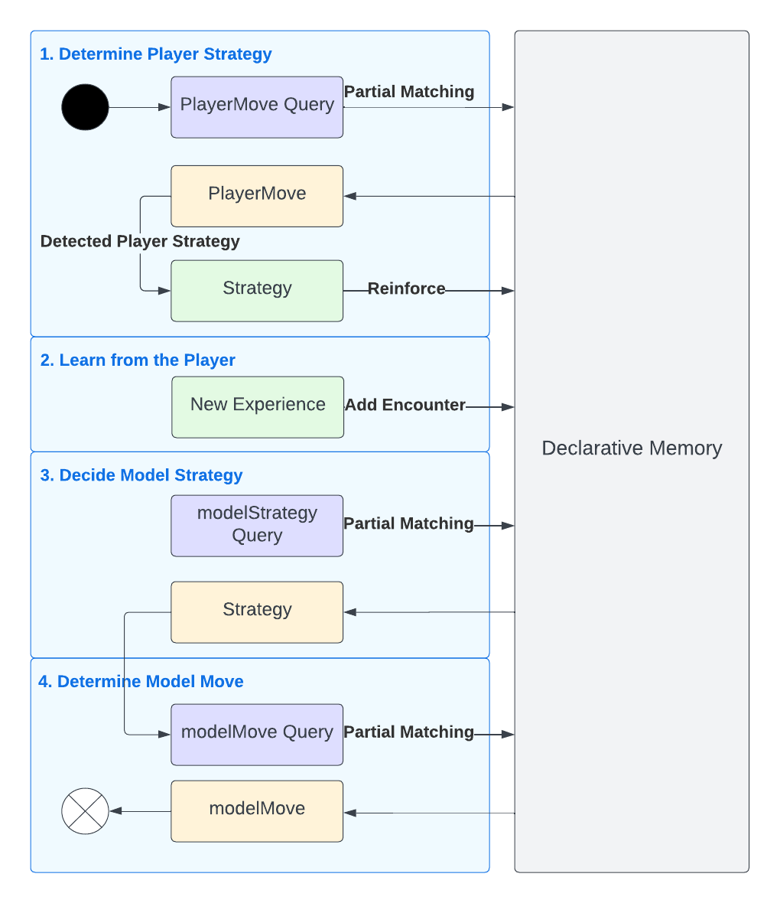
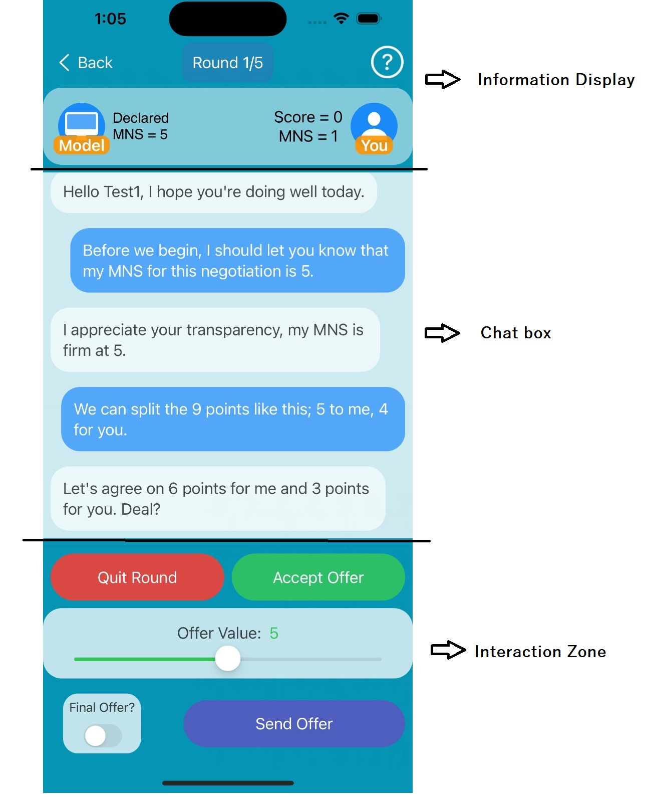

# NegotiationApp
Game of Nines app for the RUG MSc AI course Cognitive Modelling: Complex Behaviour. This app is written in Swift, for iOS devices. The cognitive model, that plays as the opponent, is designed in accordance with the principles of ACT-R.

## Cognitive Model

Model Diagram

 

The objective of this project was to develop an iOS application that would enable a human player to learn about negotiation strategies and improve their negotiation skills. To achieve this, we implement a cognitive model to act as the player's opponent in the setting of the Game of Nines, first used by Kelley (1967) in a study of human negotiation behaviours. The implementation of our cognitive model is an extension of the model proposed in Stevens (2018). The most notable addition is the use of instance-based learning, which enables the model to `learn' and reproduce the negotiation strategies of the human player. We develop this method with the objective of having a personalised model for each player, which fits to the specific behaviours of said players, and thus encourages them to improve or learn to adapt their negotiation strategy. The instance-based learning also allows the model to adapt to the skill level of the human player. On top of this, we also integrate temporal learning into the model; it observes how long it takes the player to make certain moves, and the cognitive model will reproduce these time-frames whenever it makes the same move. This adds more variety to the gameplay, as well as another dimension to the cognitive model's negotiation strategy.

## UI

Game Screen

 

As seen in the image above, the design philosophy of our application is centred around text-messaging applications such as WhatsApp or Facebook Messenger. Because the nature of the Game of Nines is for two players to make bids in an alternating fashion, we feel this dynamic format of interaction offered by text-messaging applications is suitable for this project and it thus guides the design of our UI. This forms the backbone of the game interface; the player can scroll through a `chat' of messages sent by either the player themselves as well as the model, with the sender being delineated by the positioning and colour of the messages, as in the aforementioned text-messaging applications. The chat grows in length as the game progresses, with the full history of messages sent across all rounds of the current game can be viewed by scrolling up, while the appearance of new messages causes the screen to return to the most recent messages.

